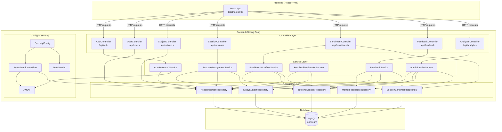
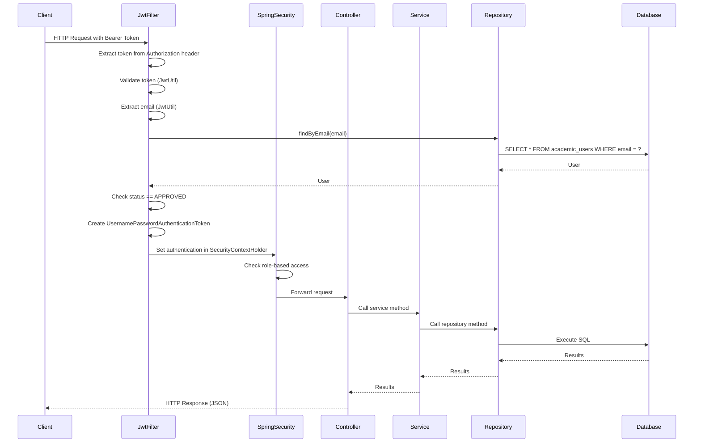
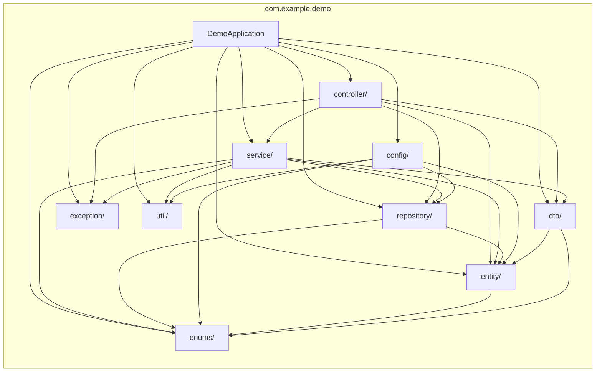
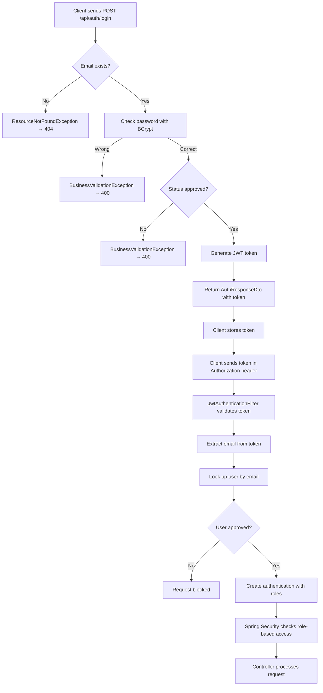

# ARCHITECTURE

This document contains Mermaid diagrams showing the architecture of the project.

---

## 1. Overall Architecture



---

## 2. Request Flow



---

## 3. Package Dependency



---

## 4. Database Relationships

```mermaid
erDiagram
    ACADEMIC_USERS ||--o{ TUTORIAL_SESSIONS : "mentor_id"
    ACADEMIC_USERS ||--o{ SESSION_ENROLLMENTS : "learner_id"
    ACADEMIC_USERS ||--o{ MENTOR_FEEDBACK : "learner_id"
    ACADEMIC_USERS ||--o{ MENTOR_FEEDBACK : "mentor_id"
    STUDY_SUBJECTS ||--o{ TUTORIAL_SESSIONS : "subject_id"
    TUTORIAL_SESSIONS ||--o{ SESSION_ENROLLMENTS : "session_id"
    TUTORIAL_SESSIONS ||--|| MENTOR_FEEDBACK : "session_id"

    ACADEMIC_USERS {
        BIGINT id PK
        VARCHAR full_name
        VARCHAR email UK
        VARCHAR password
        VARCHAR role
        VARCHAR department
        TEXT bio
        VARCHAR status
    }

    STUDY_SUBJECTS {
        BIGINT id PK
        VARCHAR name UK
        TEXT description
    }

    TUTORIAL_SESSIONS {
        BIGINT id PK
        VARCHAR title
        TEXT description
        DATETIME start_time
        DATETIME end_time
        INT max_capacity
        INT current_enrollment
        VARCHAR status
        BIGINT mentor_id FK
        BIGINT subject_id FK
    }

    SESSION_ENROLLMENTS {
        BIGINT id PK
        DATETIME enrollment_date
        VARCHAR status
        TINYINT feedback_submitted
        BIGINT learner_id FK
        BIGINT session_id FK
    }

    MENTOR_FEEDBACK {
        BIGINT id PK
        INT rating
        TEXT comment
        BIGINT learner_id FK
        BIGINT mentor_id FK
        BIGINT session_id FK UK
    }
```

---

## 5. Layered Architecture

```mermaid
graph TD
    subgraph "Layer 1: Presentation"
        FE[Frontend<br/>React/Vite<br/>localhost:3000]
    end

    subgraph "Layer 2: Web/API"
        CTRL[Controllers<br/>@RestController<br/>Handle HTTP requests]
    end

    subgraph "Layer 3: Business Logic"
        SVC[Services<br/>@Service<br/>Business rules]
    end

    subgraph "Layer 4: Data Access"
        REPO[Repositories<br/>@Repository<br/>JPA/Hibernate]
    end

    subgraph "Layer 5: Database"
        DB[(MySQL<br/>loomlearn)]
    end

    subgraph "Cross-Cutting"
        SEC[Security<br/>JWT Filter<br/>Spring Security]
        CFG[Configuration<br/>DataSeeder<br/>SecurityConfig]
    end

    FE --> CTRL
    CTRL --> SVC
    SVC --> REPO
    REPO --> DB

    SEC -.-> CTRL
    SEC -.-> SVC
    SEC -.-> REPO

    CFG -.-> REPO
```

---

## 6. Authentication Flow


